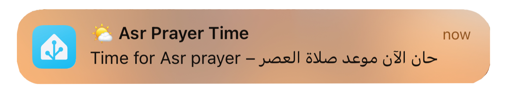

# 🕌 Azan Notifications (v2.0)

**By [Shady Nafie — Smart Tech Arabic](https://smarttecharabic.com)**

A fully customisable **Home Assistant automation blueprint** that sends timely notifications to youe mobile device for the five daily Islamic prayers — now with optional **Azan audio playback** via smart speakers.

---

## ✨ Features

- 🔔 Timley notifications for **Fajr, Dhuhr, Asr, Maghrib, and Isha**
- 🔊 Optional Adhan playback on **Google Cast, HomePod, Sonos**, and **Alexa (via Plex)**
- 🎛️ Set playback **volume level** before Azan
- 🧩 Tidy interface with **sectioned inputs** and emoji-labeled fields
- 💬 Fully editable bilingual messages per prayer

---

## 📋 Prerequisites

Make sure the following are in place before using this blueprint:

1. **Islamic Prayer Times** integration is installed and correctly configured
2. You have the **Home Assistant Mobile App** installed and notifications enabled
3. (Optional) **Plex Media Server** set up (required only for Alexa playback)

---

## 🛠️ Setup Instructions

Use this button to import the blueprint directly into your Home Assistant instance:

---

## ⚙️ Configuration

### Step 1: Create New Automation

1. Navigate to **Settings → Automations & Scenes → Blueprints**
2. Locate **"Azan Notifications v2.0"**
3. Click **Create Automation**

### Step 2: Assign Inputs

- **📱 Mobile Device** — Select the device that will receive notifications  
- **🕐 Prayer Time Sensors** — Link each prayer to the corresponding time sensor  
- **🔔 Enable/Disable Prayers** — Choose which prayers to receive alerts for  
- **💬 Custom Messages** — Optionally personalise notification messages  
- **🔊 Audio Playback** *(Optional)*  
  - Select your speaker
  - Choose type: direct or Alexa/Plex
  - Enter MP3 URL or Plex playlist name
  - Set playback volume (0.0 to 1.0)

---

## 📷 Screenshots

---

## 🤝 Contributing

This blueprint is open for feedback and improvements. Please raise an issue or submit a pull request.

---

## 📜 License

MIT License © 2025 [Smart Tech Arabic](https://smarttecharabic.com)
